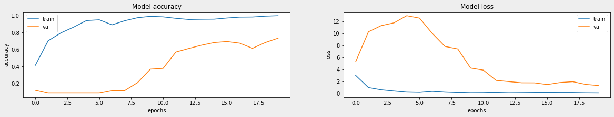
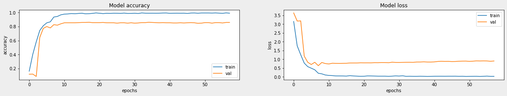

# ANBW
A number behind a word: [Dacon - 데이콘 컴퓨터 비전 학습 경진대회](https://dacon.io/competitions/official/235626/overview/description)

## Common Settings :rescue_worker_helmet:

- dataset: [Dacon - 컴퓨터 비전 학습 경진대회 데이터](https://dacon.io/competitions/official/235626/data)
- train/validation split size: 0.2
- seed: 1234

## ANBW_v1 :thinking:

  
 더보기(To see more details)

  ### Setting

- Model: Baseline Model([Dacon - 컴퓨터 비전 학습 경진대회 베이스라인 CNN)](https://dacon.io/competitions/official/235626/codeshare/1555?page=1&dtype=recent)
- Loss: categorical_crossentropy
- Optimizer: Adam
- Metrics: accuracy

### Acc & Loss 

## ANBW_v2 :cowboy_hat_face:

### Setting

- Model: EfficientNetB3
- Loss: categorical_crossentropy
- Optimizer: RMSprop
- Metrics: accuracy

### Acc & Loss

